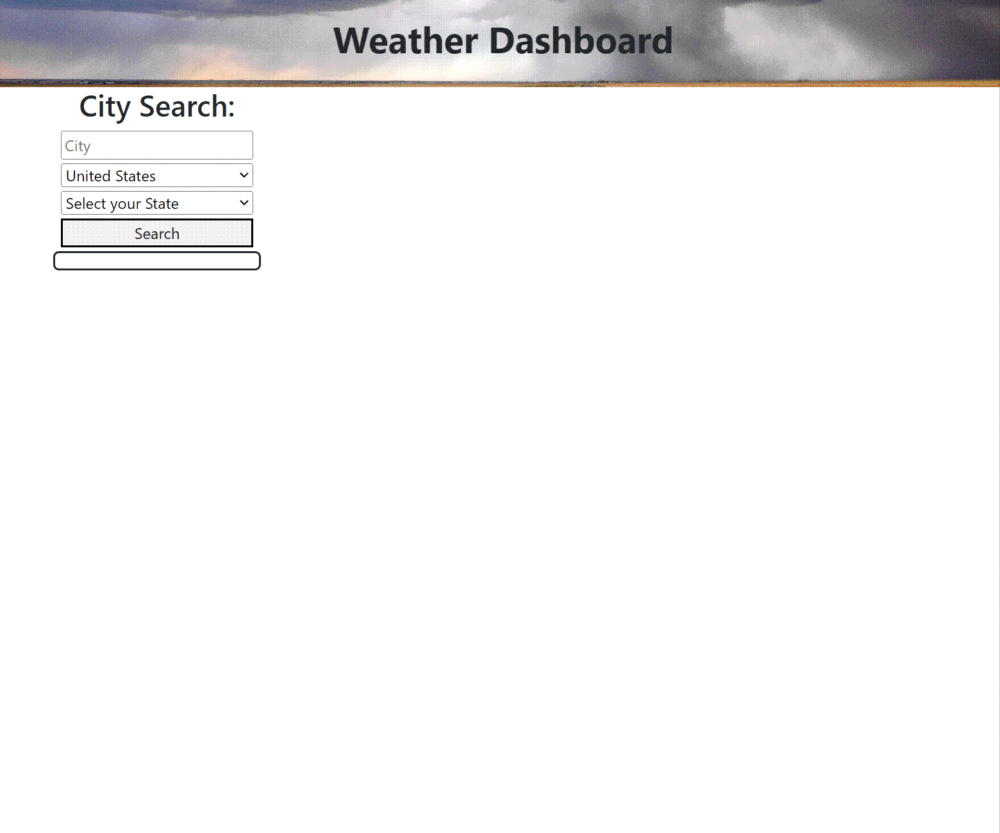

# Weather Dashboard

Browser based Weather Dashboard utilizing Third Party APIs.

---

Created by: Robert Bishop

Comments, suggestions and constructive criticism always welcome.

---

## Contents:
* [Live Page Link](#live-page-link)
* [Demo](#demo)
* [Usage](#usage)
* [Skills/Concepts Used](#skillsconcepts-used)
* [Steps Taken](#steps-taken)
* [Thoughts/Future Ideas](#thoughtsfuture-ideas)
* [Links](#links)

---

## Live Page Link:

[https://rbishop85.github.io/weather-dashboard/](https://rbishop85.github.io/weather-dashboard/)

---

## Demo:

> Demo of Weather Dashboard in operation.

---

## Usage:

- When the page is loaded for the first time The page will have a banner across the top, and a form in the upper left with fields to be filled out and a search button
- Country will be set to United States by default.  If you select any other country, the States dropdown will disappear.
- If you hit search and haven't typed a city name yet you'll get a modal popup informing you of such, or if you select a city and have the country set to United States you will also get a modal popup about that.
- If all fields are filled out properly a history button for the searched city will appear under the search form and the weather data will show to the right.
- Current weather data will be displayed at the top, including the local date, time and a UV Index with in a box colored based on the index value.  A 5 day forcast will be displayed below.
- If you search a new city then it's data will replace the weather data currently on the page.
- If you click on one of the history buttons on the left of the page, that city's weather data will appear on the page, and the button you clicked will be moved to the top of the history list.
- The history box will contain up to 6 recent searches, automatically knocking off the lowest one when you search for more than 6 locations.
- If you reload the page the weather information will disappear but the history list will remain as it's stored in local storage.

---

## Skills/Concepts Used:

* HTML for the basic layout of the page.
* CSS for a few basic things done separate from Bootstrap.
* Javascript to control the running of the app.
  - Variables & Arrays to store all the necessary values.
  - Functions to run set tasks.
  - Event Listeners to monitor button events and link to set functions.
  - If statements.
  - Interacting with the DOM to pull info from the webpage and insert content back into it.
  - localStorage to save search history for when page is reloaded
  - fetch to pull data from remote resources
* Third Party Resources.
  - Bootstrap used for page layout.
  - jQuery to simplify some code.
  - Luxon to handle date/time.
  - REST Countries to fill Countries dropdown list
  - OpenWeather Geocoding API for geo locating cities
  - OpenWeather One Call API for pulling weather data based on geo location

---

## Steps Taken:

- [x] Created repo and starter files, linking them together.
- [x] Linked in Bootstrap, jQuery and Luxon.
- [x] Worked on basic layout including header with background image.
- [x] Created search form.
- [x] Created countries dropdown list that is populated with data pulled from an api then sorted alphabetically and set with United States as default.
- [x] Created states dropdown that only appears if United States is the selected country and pulls it's list from a locally created array.
- [x] Setup search button to pull necessary info and check that all required info was entered.
- [x] Setup fetch protocol for finding the geo location of the city that was searched, if no info is found then user is notified.
- [x] Setup fetch protocol for weather data based on geo location.
- [x] Started formatting necessary data to be displayed for current weather.
- [x] Setup creation of search history buttons to make testing functionality easier.
- [x] Set search history to be stored in local storage and reloaded to page.
- [x] Put in a check so that a previously searched item won't be added to the history list if it's already in the list.  Clicking a search history item will also pull it to the top of the list and the list is limited to 6 items with the oldest being dropped if it goes over that amount.
- [x] With core functionality working, started focussing more on styling.
- [x] Switched user alerts to a modal setup.
- [x] Cleaned up coding, moving excess functions out of fetch function and into their own separate functions
- [x] Adjusted date formatting to account for time zones, and displayed current time to make it clear you were pulling proper data for non local cities.
- [x] Inserted detailed comments in files.
- [x] Wrote README.

---

## Thoughts/Future Ideas:

There was a lot of trial and error with this project.  Decided from the start to use Luxon instead of Moments since it is more modern.  I had fun trying to work out little details such as having wind direction shown as compass coordinates instead of degrees.  Also noticed near the end that dates weren't showing properly for cities in time zones that are on a separate date, so spent a while researching how to fix that.  The biggest thing with this project that I would like to continue to sort out is a cleaner and more aesthetically pleasing appearance.

---

## Links:

<a href="https://getbootstrap.com/" target="_blank">Bootstrap</a>

<a href="https://jquery.com/" target="_blank">jQuery</a>

<a href="https://moment.github.io/luxon/#/" target="_blank">Luxon</a>

<a href="https://restcountries.com/" target="_blank">REST Countries</a>

<a href="https://openweathermap.org/api/geocoding-api" target="_blank">OpenWeather Geocoding API</a>

<a href="https://openweathermap.org/api/one-call-api" target="_blank">OpenWeather One Call API 1.0</a>

---

[Top of Page](#weather-dashboard)